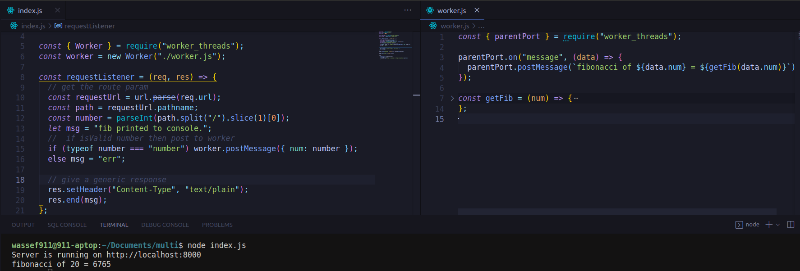

## Multithreading in node ?

Worker threads are run on these isolated V8 engines, each worker having its own V8 engine and event queue. In other words, when workers are active, a Node application has multiple Node instances running in the same process.

V8 supports the creation of isolated V8 runtimes. These isolated instances, known as V8 Isolate , have their own Javascript heaps and micro-task queues.

## interesting reads:

[Official Docs](https://nodejs.org/api/worker_threads.html)

[Article 1](https://blog.logrocket.com/node-js-multithreading-worker-threads-why-they-matter/)

[Article 2](https://www.section.io/engineering-education/nodejs-worker-thread/)
